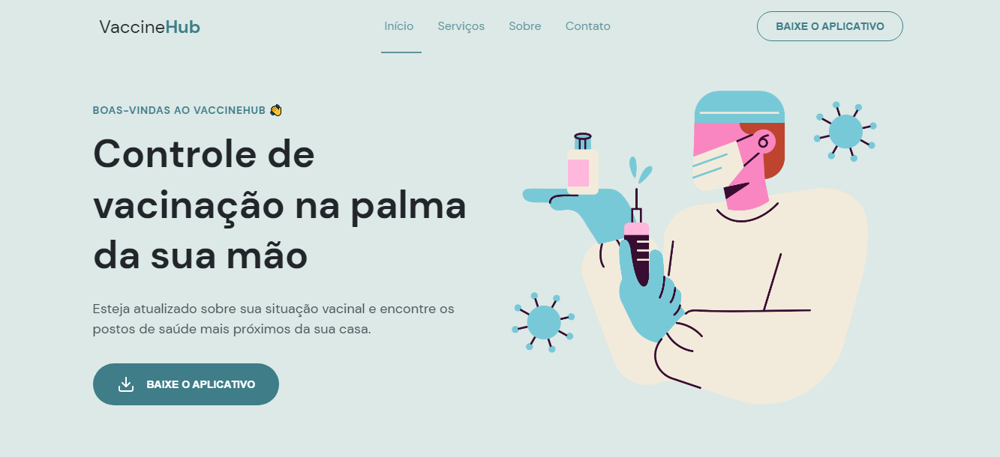

<h1 align="center">
  VaccineHub
</h1>

  

  <a href="#-techs">Tecnologias</a>&nbsp;&nbsp;&nbsp;|&nbsp;&nbsp;&nbsp;
  <a href="#-projeto">Projeto</a>&nbsp;&nbsp;&nbsp;|&nbsp;&nbsp;&nbsp;
  <a href="#-layout">Layout</a>&nbsp;&nbsp;&nbsp;&nbsp;&nbsp;&nbsp;

## 🛠️ Techs

Esse projeto foi desenvolvido utilizando as tecnologias:

- HTML
- CSS
- JavaScript

## 💻 Projeto

Esse projeto, baseado na aplicação criada durante o evento NLW Return, da RocketSeat, consiste em uma página para um aplicativo fictício chamado "VaccineHub", no qual o usuário teria acesso à cartilha de vacinas pendentes, localização dos postos de saúde ou centros de vacinação mais próximos, histórico e resultado de exames, entre outras funcionalidades.

A página está estruturada no formato One Page e é totalmente responsiva, adaptando-se aos diversos dispositivos móveis e desktop. 

Link para conferir o projeto: https://edusmpaio.github.io/vaccinehub/

## 🖼️ Layout

O layout do [Figma](https://figma.com) no qual esse projeto foi baseado encontra-se [nesse link](https://www.figma.com/community/file/1102912263666619803).
